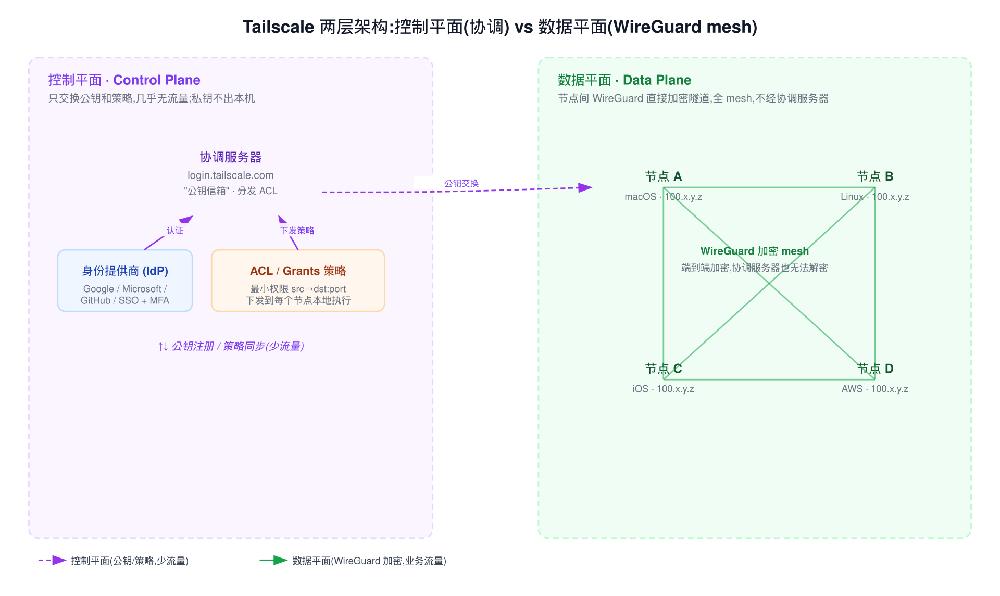
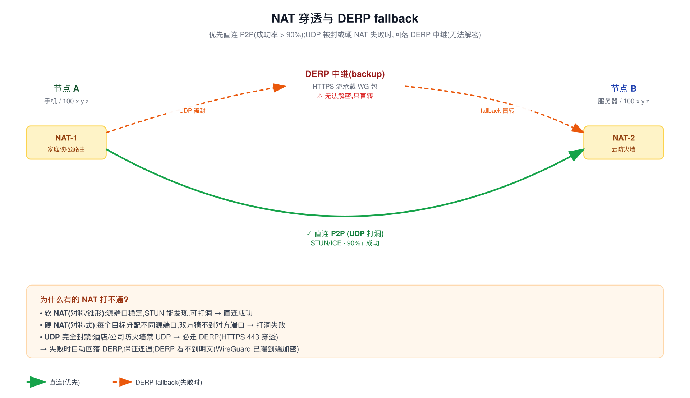
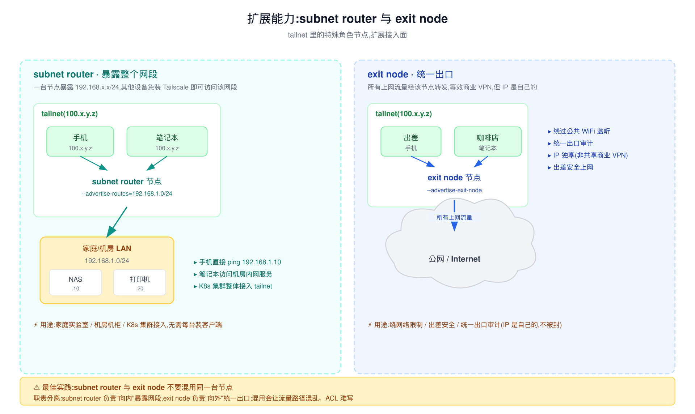
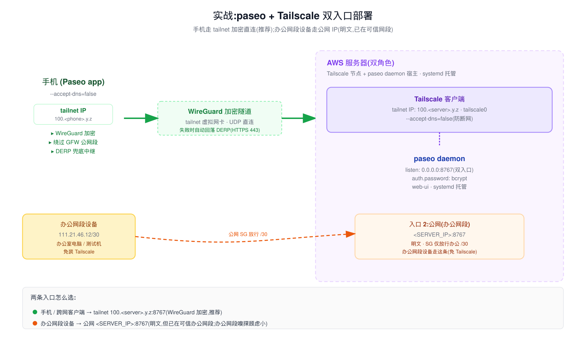

# Tailscale 科普指南

> 这是一份独立的 Tailscale 科普文档,讲清楚它**是什么、怎么工作、解决什么具体问题、怎么用、怎么收费、最佳实践**。和 paseo 文档并列;最后一节用 paseo + Tailscale 的真实部署作为综合案例。
>
> 配套阅读:[`direct-connect.md`](../guides/direct-connect.md)(paseo 直连安全分析)、[`adr.md`](../adr/adr.md) ADR-0006(paseo 用 Tailscale 的决策)。

---

## 一、Tailscale 是什么

**一句话**:基于 WireGuard 的 zero-config mesh VPN,把分散在各地的设备组成一个虚拟局域网(tailnet)。

核心承诺:

- **不开端口、不改防火墙**——NAT 后的设备也能互通。
- **全 mesh 点对点**——不是传统 VPN 的 hub-and-spoke,设备间直接相连,延迟低。
- **端到端加密**——基于 WireGuard,连 Tailscale 公司的协调服务器都无法解密你的流量。
- **身份驱动**——用 SSO(Google/Microsoft/GitHub 等)登录,没有独立的 VPN 用户名密码库。

定位上,它**不是**用来"翻墙看 Netflix"的传统 VPN 替代品;它是**给团队和个人的零信任设备互联层**——把"我的设备"和"别人的设备"在网络上隔开,只让你的设备彼此互通。

---

## 二、它解决了哪些具体问题

对每个场景说清:**传统方案为什么痛 → Tailscale 怎么解决 → 怎么用**。

| 问题 | 传统方案(痛) | Tailscale 方案 | 怎么用 |
|---|---|---|---|
| 访问家里/办公室 NAT 后的服务 | 端口转发 / 内网穿透 / 申请公网 IP | 设备装 Tailscale,tailnet IP 直达 | 两端 `tailscale up`,用 `100.x.y.z` 访问 |
| 多地办公设备互联 | VPN 集中器(hub-and-spoke,绕远路延迟高) | 全 mesh,点对点直连 | 同上,自动 mesh |
| 给外包/临时成员访问内网 | 开 VPN 账号 + 改防火墙规则,吊销麻烦 | SSO 登录 + ACL 按身份授权,随时吊销 | 在 admin console 把用户加进 tailnet,配 ACL |
| 手机连服务器跑 AI agent | 公网开端口(明文 / 暴露面大) | tailnet 加密直连,不开公网端口 | 手机和服务器都装 Tailscale,见第八节 |
| 绕过网络限制(如 GFW) | 商业 VPN(共享 IP、易被封) | exit node(自己的节点,IP 独享) | 把一台节点配成 exit node,手机选它作出 |
| K8s 集群 / 家庭局域网整体接入 | 每台装 VPN 客户端,运维爆炸 | subnet router 一台暴露整个网段 | 见第五节 |
| 团队 SSH 管理 | 跳板机 + SSH key(密钥散落) | Tailscale SSH(身份即凭据,自动 MFA) | `tailscale serve` / SSH 功能 |

**核心心智模型**:Tailscale 不是"连上一个 VPN 服务器",而是"把你的所有设备拉进同一个虚拟局域网"。区别在于:传统 VPN 是星型(所有流量经中心),Tailscale 是 mesh(设备间直连)。

---

## 三、工作原理:两层架构



Tailscale 把网络分成两层:

### 控制平面(Control Plane)——协调,几乎无流量

- **协调服务器**(`login.tailscale.com`)像一个"公钥信箱":节点启动时把自己的公钥 + 当前网络位置注册上去,再从信箱里拉取同 tailnet 其他节点的公钥。
- **关键**:**私钥永远不出本机**。协调服务器只看到公钥,无法解密任何业务流量。
- **身份提供商**(IdP):认证外包给 SSO(Google/Microsoft/GitHub 等),2FA/MFA 由 IdP 处理。Tailscale 自己不存密码。
- **ACL/Grants 策略**:在协调服务器上集中编辑,下发到每个节点**本地执行**——节点独立拦截未授权的入站连接,不信任协调服务器做实时决策。

### 数据平面(Data Plane)——WireGuard mesh,业务流量

- 节点拿到对方的公钥后,用 WireGuard 直接建立加密隧道。
- **全 mesh**:每两个节点之间都是直连,流量不经过任何中心节点。
- WireGuard 是现代加密协议,内核级性能,比 IPsec/OpenVPN 快、配置简单。

**这两层分离的好处**:控制平面只传极少量的密钥和策略(几 KB),挂了也不影响已建立的 mesh 连接;数据平面完全分布式,扩展性随节点数提升而非下降。

---

## 四、NAT 穿透与 DERP fallback(直连 vs 中继的完整决策机制)

这是 Tailscale 最"魔法"的部分:**两台都在 NAT 后面的设备,不开任何端口,怎么直接连上?更关键的是——什么时候能直连,什么时候被迫走中继?**



### 4.1 两种连接方式是什么

| | 直连(Direct / P2P) | DERP 中继(Relay) |
|---|---|---|
| **物理路径** | 设备 A ──( WireGuard UDP )── 设备 B | 设备 A ──> DERP 服务器 ──> 设备 B |
| **协议/端口** | UDP,源/目标端口由 NAT 打洞决定 | HTTPS(TCP/443),伪装成普通网页流量 |
| **延迟/带宽** | 最低(两点间直通,通常跑满带宽) | 高(多一跳,且 DERP 节点有上限) |
| **加密** | WireGuard 端到端加密 | **同样是 WireGuard 端到端加密**——DERP 只是转发加密字节流,自己无法解密 |
| **安全性** | 无差异——DERP 不降安全,只降性能 | 同上 |

**关键澄清**:DERP **不是降级加密**,只是降级性能。即使全走 DERP,Tailscale 仍然是端到端加密的;DERP 服务器(无论官方的还是自建的)看到的只是一坨密文字节流。

### 4.2 决策算法:Tailscale 怎么决定走哪条

**心智模型先纠偏**:不是"先试直连,失败再切 DERP"的串行逻辑,而是**并行维持两条路径,实时挑当前最优的**。

实际流程:

1. **双方都连上 DERP**(永远在先)
   - 节点启动时,立刻和最近的 DERP 服务器建一条 HTTPS 长连接(控制流量,极小)。
   - 这条 DERP 连接**全程不断**,即使你后来成功直连了,DERP 连接也保留作为兜底和控制信道。

2. **通过协调服务器交换"网络位置"**
   - 每个节点把自己的公网 IP、NAT 映射后的源端口等信息,通过 DERP 互相告知(这是 disco 协议)。
   - 协调服务器(login.tailscale.com)只帮传递公钥和网络位置,不参与数据。

3. **双方尝试 UDP 打洞**(并行)
   - 双方各自向对方的"推测公网地址:端口"发 UDP 包(叫"打洞")。
   - NAT 看到自己这边主动发出了包,就会允许对方的回包进入——洞就开了。
   - 用到 STUN/UPnP/PMP/PCP 等多种协议协助发现 NAT 后的真实地址。

4. **打洞结果决定最终路径**
   - **打洞成功**:Upgrade 到直连 UDP,DERP 退居二线(只保留长连接做控制信道,业务流量不再走它)。
   - **打洞失败**(硬 NAT / UDP 被防火墙封禁):业务流量继续走 DERP。
   - **直连质量恶化**(丢包/中断):自动 fallback 回 DERP,无需重连。

5. **运行中持续重新评估**
   - 网络环境变化(切换 WiFi、移动到新网段)时,Tailscale 会重新尝试打洞,可能从 DERP 升级到直连,反之亦然。
   - 你看到的"直连"或"DERP"是**当前瞬时状态**,不是钉死的。

### 4.3 决定成败的关键:NAT 类型

打洞能不能成功,完全取决于**两边 NAT 设备的行为**。Tailscale 把 NAT 分成两类:

- **软 NAT**(锥形 / Cone NAT):同一内部源端口,对所有目标都保持一致映射。STUN 能直接探测出"我对外长什么样",双方互相告知后就能打洞 → **可直连**。
- **硬 NAT**(对称式 / Symmetric NAT):每个不同目标都分配一个**新的随机源端口**,对方根本猜不到你下一个端口是多少 → **打洞必败**。

经验法则:**只要两边有一边是硬 NAT,就只能走 DERP**。两边都是软 NAT,几乎一定能直连。

> 本机 NAT 类型可以用 `tailscale netcheck` 看,关键字段是 `MappingVariesByDestIP`:
> - `false` = 软 NAT(锥形),打洞有戏
> - `true` = 硬 NAT(对称),本节点会拖累所有对端走 DERP

### 4.4 实战:如何判断我现在走的是直连还是 DERP

**命令 1:`tailscale status`**(最常用)

```bash
$ tailscale status
100.96.58.54     macbook-pro      john.mr.wx@  macOS  -
100.125.82.93    agen2b           john.mr.wx@  linux  active; relay "hkg", tx 56532 rx 823804
100.109.195.126  ip-10-20-16-133  john.mr.wx@  linux  active; direct 13.236.113.51:41641, tx 37724 rx 67152
100.66.245.85    iphone181        john.mr.wx@  iOS    active; relay "tok", tx 269756 rx 32644
```

看每行末尾的状态字段:

- `direct <IP>:<port>` —— **直连成功**,后面跟对方真实公网地址
- `relay "<DERP代号>"` —— **正在走 DERP**,"hkg"=Hong Kong / "tok"=Tokyo,是 DERP 节点位置
- 空(`-` / `idle`)—— 当前没有活跃流量(空闲时不显示)

**命令 2:`tailscale ping <对端>`**(强制探测当前路径)

```bash
$ tailscale ping agen2b
pong from agen2b (100.125.82.93) via DERP(hkg) in 65ms
pong from agen2b (100.125.82.93) via DERP(hkg) in 64ms
```

输出会明确告诉你 `via DERP(hkg)` 还是 `direct`。它会**多次探测**,期间会尝试打洞升级,你能看到从 DERP 切换到 direct 的过程(如果打洞成功)。

**命令 3:`tailscale netcheck`**(看本机网络环境)

```bash
$ tailscale netcheck
Report:
	* UDP: true                          # UDP 可用(若 false,基本告别直连)
	* IPv4: yes, 120.192.215.66:11014
	* MappingVariesByDestIP: true        # ⚠️ true 表示本机是对称 NAT,会拖累对端走 DERP
	* CaptivePortal: false
	* Nearest DERP: Hong Kong
	* DERP latency:
		- hkg: 65.1ms  (Hong Kong)       # 就近 DERP 节点延迟
		- tok: 85.7ms  (Tokyo)
		- ...
```

`MappingVariesByDestIP: true` 是判断"我这边为什么连不上直连"最直接的指标——true 说明本机 NAT 是对称的,大概率你和任何人都是 DERP。

### 4.5 如何影响决策(强制 / 优化)

| 想做的事 | 方法 |
|---|---|
| **强制只走 DERP**(调试/特殊场景) | `tailscale up --netfilter-mode=off` 之外的官方做法是 `tailscale debug via <node>`;一般用户不强制。更常见的诉求反而是:为什么我走 DERP? |
| **提高直连成功率** | 路由器开 UPnP / NAT-PMP;家用路由器把 Tailscale 设备设为 DMZ;更换对称 NAT 严重的运营商 |
| **自建 DERP**(降延迟/数据主权) | 见 [官方自建 DERP 文档](https://tailscale.com/kb/1118/custom-derp-servers)。paseo 跨境场景常用:在大陆节点自建 DERP,避免官方 DERP 全在境外 |
| **看实时打洞日志** | `tailscale debug disco <node>` 或 `journalctl -u tailscaled -f` 看 `magicsock` 日志 |

### 4.6 为什么 Tailscale 设计成"DERP 永远在线"

新手常问:既然 DERP 慢,为什么不"直连成功就关掉 DERP"?

三个原因:

1. **DERP 是控制信道的载体**——节点间交换 disco 信息(端口、NAT 类型)走 DERP,因为它一定通。如果 DERP 关了,直连断了之后没东西帮你重新协调。
2. **DERP 是无缝 fallback**——直连链路突然恶化(无线切换、运营商抖动)时,业务流量无感切到 DERP,体验是"卡一下"而不是"断线重连"。
3. **DERP 是硬 NAT 场景的唯一通路**——企业网络、酒店 WiFi、运营商级 NAT(CGNAT)经常是无法直连的,DERP 保证"无论如何都能用"。

> **一句话总结**:DERP 同时承担"控制信道 + 兜底数据信道"两个角色,这就是为什么它永远不断开——即使你看到状态是 `direct`,后台那条 DERP 连接仍然活着,只是不跑业务流量。

---

## 五、扩展能力:subnet router 与 exit node

除了"把设备拉进 tailnet",Tailscale 还能通过特殊角色节点扩展接入面。



### subnet router:暴露整个网段

一台节点把自己配成 subnet router,声明"我能到达 `192.168.1.0/24`",tailnet 里其他设备就能通过它访问那个网段里的设备——**不用每台都装 Tailscale**。

```bash
# 在能访问目标网段的节点上
tailscale up --advertise-routes=192.168.1.0/24
# admin console 里批准这条路由
```

**典型场景**:
- 家庭实验室:一台 NAS 装 Tailscale,手机就能访问家里所有 IoT 设备。
- 机房机柜:一台跳板机暴露整个机柜网段。
- K8s 集群:一台节点把集群 CIDR 接入 tailnet。

### exit node:统一出口

把节点配成 exit node,所有上网流量经它转发——等效传统 VPN,但 **IP 是你自己的**(不是和几千人共享的商业 VPN IP)。

```bash
# 在 exit node 节点上
tailscale up --advertise-exit-node
# admin console 批准
# 客户端:tailscale up --exit-node=<that-node>
```

**典型场景**:
- 绕过公共 WiFi 监听(咖啡店 / 机场)。
- 统一团队出口审计。
- 出差时安全上网(IP 独享,不被 Netflix/Google 误判为机器人)。

### 关键约束

**subnet router 与 exit node 不要混用同一台节点**——职责分离:subnet router 负责"向内"暴露网段,exit node 负责"向外"统一出口;混用会让流量路径混乱、ACL 难写。

---

## 六、最佳实践

基于官方文档和踩坑经验,可操作清单:

### 安全

- **ACL/Grants 做最小权限**:默认 deny,只放需要的 `src → dst:port`。Grants 是新一代模型,推荐用。
- **关闭公网 SSH,只留 tailscale0 接口**:
  ```bash
  ufw allow in on tailscale0
  ufw deny 22/tcp        # 关掉公网 SSH
  ```
- **启用 SSO MFA**:在身份提供商侧强制 2FA,Tailscale 自动继承。
- **关键服务器关 key expiry**:防密码过期锁死,但**必须留 console 兜底访问**(云厂商的 VNC/串口)。
- **验证**:断开 Tailscale 后 SSH 应失败,重连后应成功——证明 SSH 完全走 tailnet。

### 网络(重点)

- ⚠️ **MagicDNS 接管系统 DNS 会导致断网**(已知高频问题,见我们 paseo 部署踩过的坑)。GitHub issues [#14924](https://github.com/tailscale/tailscale/issues/14924) / [#10225](https://github.com/tailscale/tailscale/issues/10225) / [#16985](https://github.com/tailscale/tailscale/issues/16985) 都指向它。
  - **推荐修复**:`tailscale set --accept-dns=false`,或在 admin console 关 MagicDNS / 不勾 Override local DNS。
  - 代价:失去 tailnet 自定义 DNS 短名,但用 `100.x.y.z` IP 直连不影响功能。
- **优先用 100.x.y.z IP 直连**,避免依赖 MagicDNS 短名(更稳定,跨配置不变形)。
- **exit node 与 subnet router 不要混用**(见第五节)。

### 运维

- **官方脚本安装**:`curl -fsSL https://tailscale.com/install.sh | sh`,走 systemd 托管(`systemctl enable --now tailscaled`)。
- **无人值守设备用 auth key 初始化**:避免交互登录。
  ```bash
  tailscale up --authkey=tskey-auth-xxxxx
  ```
- **K8s 用官方 Kubernetes Operator**:自动 ingress/egress,见 [tailscale.com/kb/1236/kubernetes-operator](https://tailscale.com/kb/1236/kubernetes-operator)。
- **日志位置**:`journalctl -u tailscaled -f`(Linux);`/var/log/tailscaled.log`。

---

## 七、产品定位与收费

### 定位

Tailscale 不是传统 VPN(不用于"翻墙看流媒体"),是**给团队/个人的零信任设备互联层**。对标传统 IPsec/OpenVPN(hub-and-spoke、配置复杂),优势是:

- zero-config(装上登录就用)
- mesh(点对点直连,低延迟)
- 身份驱动(SSO + ACL,无独立 VPN 账号)
- NAT 穿透(不开端口)

### 用户群体

- **个人极客**:家庭实验室、远程办公、跨设备互联。
- **小团队**:多人共享内网资源、外包协作。
- **企业 IT/安全团队**:零信任网络接入、统一出口审计、SSH 管理。

### 收费(2026,seat-based 按席位计费)

| Plan | 价格 | 关键限制 |
|---|---|---|
| **Personal** | $0 永久 | 6 设备,个人用 |
| **Standard** | ~$6-8/用户/月 | 小团队 |
| **Premium** | $18/用户/月 | 高级 ACL、审计 |
| **Enterprise** | 联系销售 | 大规模、强制 SSO |

**2026 变化**:商业版从按用量计费切到**按席位计费**(2026-04 起);Personal 永久免费且扩到 6 设备。

### 可自托管(headscale)

如果不想依赖 Tailscale 公司的基础设施,可以用 [headscale](https://github.com/juanfont/headscale)(开源、非官方)替代协调服务器——零成本,完全自主,但运维自负,且部分高级功能(ACL 管理 UI、审计日志)缺失。适合:预算为零、对数据主权敏感、有能力自运维的团队。

---

## 八、实战案例:paseo + Tailscale 双入口部署

把前面几节的概念落到一个真实场景:用 Tailscale 给 paseo daemon 做加密直连。



### 问题(为什么要用 Tailscale)

paseo daemon 默认监听 `0.0.0.0:8767` + 密码认证。实测抓包验证(见 [`direct-connect.md`](../guides/direct-connect.md) §二):**所有 API 流量在公网线缆上全明文**——你发给 agent 的任务、agent 跑的 shell 命令、工作目录、`Authorization` 头,都能被同网段或路径上的攻击者嗅探。密码只防"未授权访问",不防"窃听"。

### 方案(怎么用 Tailscale 解决)

两端装 Tailscale,daemon 监听 `0.0.0.0`(双入口),手机走 tailnet 加密:

1. **服务器**:`systemctl enable --now tailscaled` + `tailscale set --accept-dns=false`(防断网)+ `tailscale up`,拿到 `100.<server>.y.z`。
2. **手机**:装 Tailscale app,同样关 "Use Tailscale DNS",登录同一 tailnet,拿到 `100.<phone>.y.z`。
3. **paseo daemon**:`config.json` 的 `listen` 保持 `0.0.0.0:8767`(同时接到 tailnet 和公网),`hostnames` 加 tailnet IP。
4. **云防火墙分层**:撤销公网 `0.0.0.0/0`;保留办公网段 `/30` 全端口规则。
5. **手机配 host**:填 `100.<server>.y.z:8767` + 密码,走 WireGuard 加密。

### 流量路径

- **手机 → tailnet → 服务器**:WireGuard 加密,绕过 GFW 公网段,DERP 兜底。
- **办公网段设备 → 公网 IP**:明文,但已在可信办公网段内,可接受。

### 关键决策与权衡(对应 ADR-0006)

见 [`adr.md`](../adr/adr.md) ADR-0006。核心约束:

- **SG 不能误开 `0.0.0.0/0`**——否则 daemon 全网暴露。
- **手机必须填 tailnet IP**——填了公网 IP 就退化成明文。
- **两端都 `--accept-dns=false`**——否则 MagicDNS 改系统 DNS 导致断网(第六节)。
- **密码仍然必设**——tailnet 内的设备也可能被入侵,密码是最后一道闸。

### 回滚

想完全关公网:改 `listen` 为 `100.<server>.y.z:8767` + 重启 paseo 即可;SG 规则留着不影响(daemon 不在那监听)。

---

## 九、参考

### 官方文档与博客

- [How Tailscale Works](https://tailscale.com/blog/how-tailscale-works) —— 架构权威介绍
- [How NAT Traversal Works](https://tailscale.com/blog/how-nat-traversal-works) —— NAT 穿透深度
- [How Tailscale is improving NAT traversal (Part 1)](https://tailscale.com/blog/nat-traversal-improvements-pt-1) —— 最新改进,含 90%+ 成功率数据
- [MagicDNS](https://tailscale.com/docs/features/magicdns) —— MagicDNS 文档
- [Subnet Routers](https://tailscale.com/docs/features/subnet-routers) —— subnet router
- [Exit Nodes](https://tailscale.com/docs/features/exit-nodes) —— exit node
- [ACL Policy Examples](https://tailscale.com/docs/reference/examples/acls) —— ACL 示例
- [Pricing](https://tailscale.com/pricing) —— 收费

### 我们踩坑相关的 GitHub issues

- [#14924 DNS fails when using exit node](https://github.com/tailscale/tailscale/issues/14924)
- [#10225 Enabling MagicDNS or "Override local DNS" breaks connectivity](https://github.com/tailscale/tailscale/issues/10225)
- [#16985 DNS resolution does not work while using exit-node on Android 14](https://github.com/tailscale/tailscale/issues/16985)

### 自托管

- [headscale](https://github.com/juanfont/headscale) —— 开源协调服务器替代

### 本仓库相关文档

- [`direct-connect.md`](../guides/direct-connect.md) —— paseo 直连的明文风险分析(抓包证据)
- [`adr.md`](../adr/adr.md) ADR-0005 / ADR-0006 —— 切到 Tailscale 的决策与双入口权衡
- [`linux-ops.md`](../ops/linux-ops.md) —— paseo 运维(含 Tailscale 相关坑)
